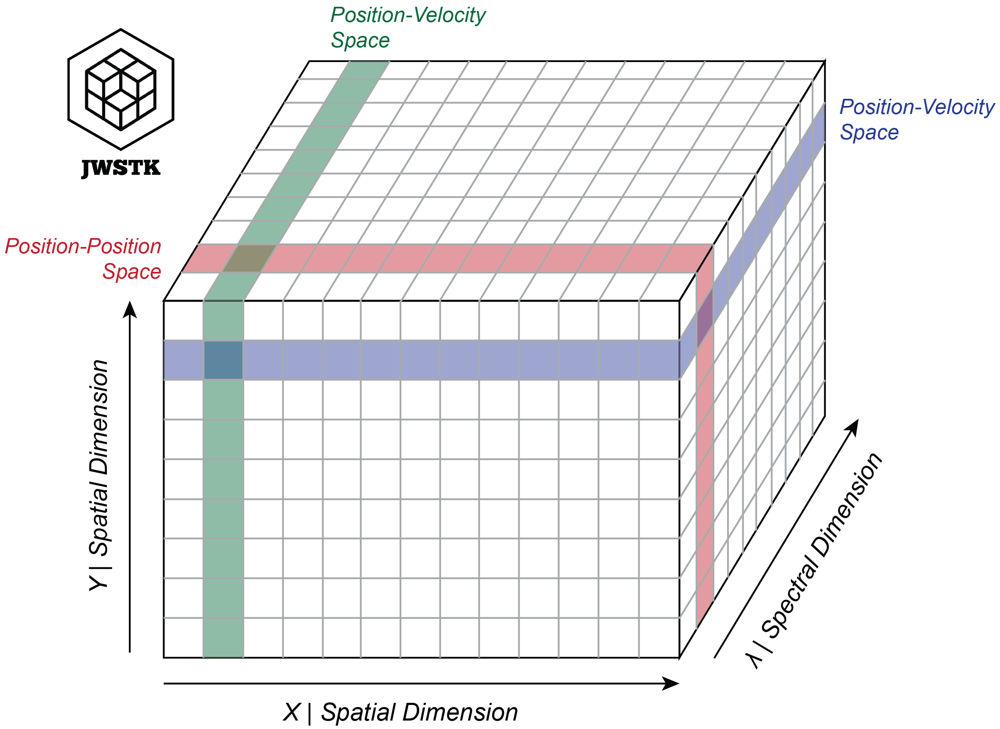
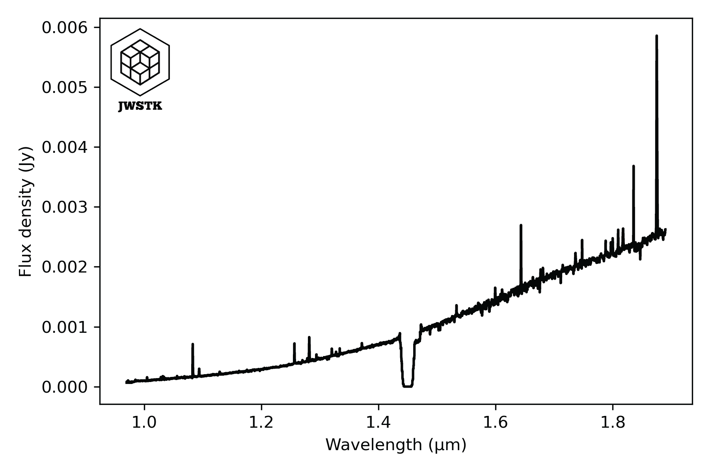
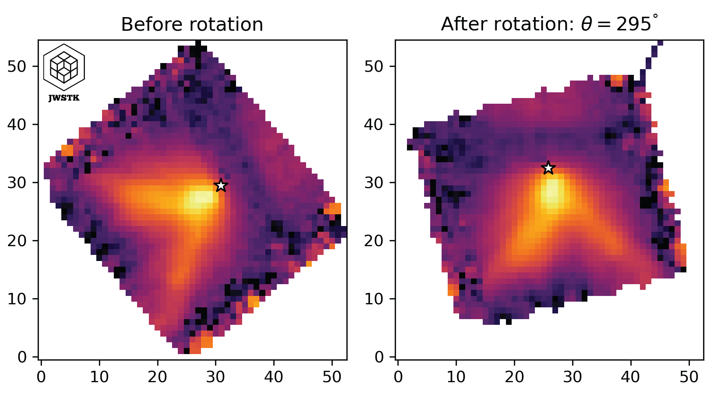
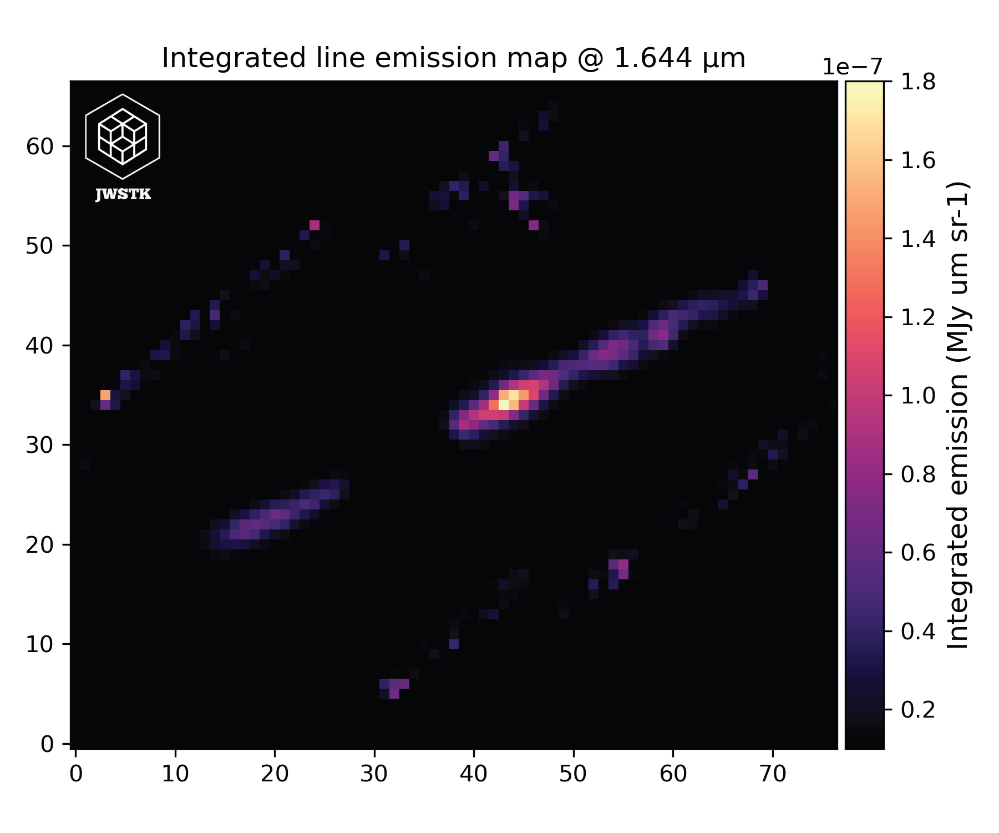
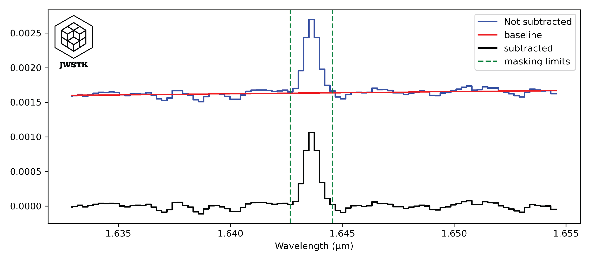
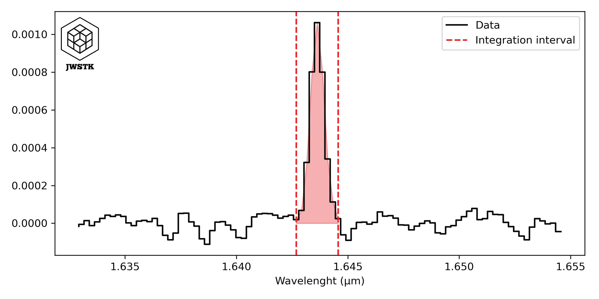
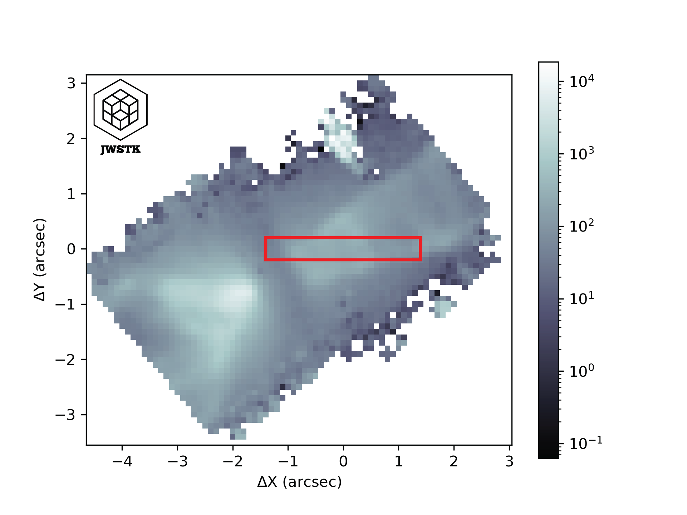
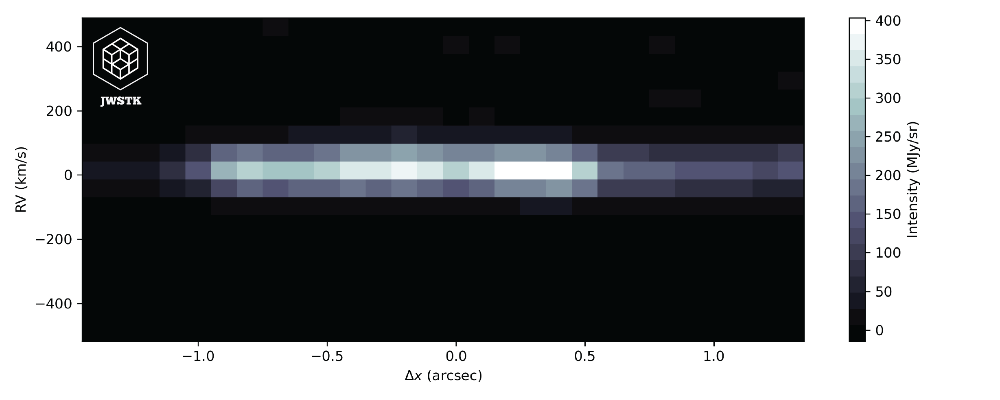

How to use *Cube* object ?
===========================

Data cube structure
-------------------

The spectro-imaging data generated by the JWST instruments respects the same 
characteristics as the vast majority of observations made with telescopes on 
Earth (e.g. ALMA, ESO/SINFONI-MUSE, etc.). Data are stored in a 3-dimensional 
array. Two dimensions correspond to spatial coordinates (x,y), the third 
dimension is a spectral dimension, by default given in microns (λ). By fixing 
a wavelength on the spectral axis, we extract a 2D array corresponding to 
an image, conventionally called a channel map. 

Create a data cube using *JWSToolKit*
---------------------------------------

Getting started
^^^^^^^^^^^^^^^^

After installing the package, simply call the module 'Cube' in the 
python code and specify the name of the file to be opened: 

.. code-block:: python 

    from JWSToolKit import Cube

    file = "DataCube_s3d.fits"
    cube = Cube(file)

    cube.info()

*cube.info()* prints the information associated with the data stored 
in the file's headers in the terminal. Here's an example of the output: 

.. code-block:: console

    __________ DATA CUBE INFORMATION __________
    Data file name:DataCube_s3d.fits
    Program PI: Dougados, Catherine, for the project: A cornerstone study of the jet/outflow connexion: the remarkable DG Tau B system
    Program ID: 01644
    Target: DG TAU B
    Telescope: JWST \ Instrument: NIRSPEC
    Configuration: G140H + F100LP
    Number of integrations, groups and frames: 2, 20, 1
    Dither strategy: True
    Dither patern type: 4-POINT-DITHER

    Date and time of observations: 2022-09-05 | 14:04:52.091999
    Target position in the sky: RA(J2000) = 66.76086125 , Dec(J2000) = 26.09164722222222
    Effecive Exposure Time: 9336.896 s
    Total Exposure Time (with overheads): 9803.728 s

    Data type and shape: Data Cube | 77, 67, 3915 (x, y, wvs)
    Spatial pixel sizes in deg (dx, dy): 2.77777781916989e-05, 2.77777781916989e-05
    Spatial pixel sizes in arcsec (dx, dy): 0.1, 0.1
    Spectral pixel size (µm): 0.000235
    Spectral range of observations (µm): 0.9700000000000001 - 1.89
    Units of spectral pixel values: MJy/sr

In this example, and in the following description, the data presented are those 
from the 1644 program of Cycle 1 JWST. These data are presented and analyzed in 
*Delabrosse et al. 2024*. The first section presents general data information: 
the project's 'principal investigator', the name of the target, the instrument 
used and the instrument configuration. 
The second section places the observations in time and space, giving the date 
the data was taken and the exact position of the target. The last section provides 
more detailed information on data parameters. For this example, the data cube has 
77 and 67 pixels in the X and Y directions and has 3915 channels maps (the sampling 
of the spectral axis). The method provides information on pixel size, spectral 
sampling and the unit of cube values. 

Attributes of the 'Cube' object
^^^^^^^^^^^^^^^^^^^^^^^^^^^^^^^

+-----------------------+---------------------------------------------------------------------------------------------------+
| Attribut              | What is it?                                                                                       |
+=======================+===================================================================================================+
| Cube.file_name        | The name of the file in .FITS format.                                                             |
+-----------------------+---------------------------------------------------------------------------------------------------+
| Cube.primary_header   | The primary header of .FITS data.                                                                 |
+-----------------------+---------------------------------------------------------------------------------------------------+
| Cube.data_header      | The header associated with data science (i.e. the data cube).                                     |
+-----------------------+---------------------------------------------------------------------------------------------------+
| Cube.data             | The data cube, values stored in a 3D array.                                                       |
+-----------------------+---------------------------------------------------------------------------------------------------+
| Cube.errs             | Errors associated with science data, stored in a 3D array.                                        |
+-----------------------+---------------------------------------------------------------------------------------------------+
| Cube.size             | Data cube dimensions (nλ, nx, ny).                                                                |
+-----------------------+---------------------------------------------------------------------------------------------------+
| Cube.px_area          | Area of spatial pixels, in arcsec^2.                                                              |
+-----------------------+---------------------------------------------------------------------------------------------------+
| Cube.units            | The unit of data cube values, by default these values are surface brightnesses given in MJy/sr.   |
+-----------------------+---------------------------------------------------------------------------------------------------+

Methods of the 'Cube' object
^^^^^^^^^^^^^^^^^^^^^^^^^^^^^^^

+-----------------------------------+---------------------------------------------------------------------+
| Method                            | What does it do?                                                    |
+===================================+=====================================================================+
| Cube.info()                       | Prints data-related information stored in headers.                  |
+-----------------------------------+---------------------------------------------------------------------+
| Cube.get_wvs()                    | Returns the wavelength axis.                                        |
+-----------------------------------+---------------------------------------------------------------------+
| Cube.get_px_coords()              | Converts R.A. Dec. coordinates in degrees to pixel coordinates.     |
+-----------------------------------+---------------------------------------------------------------------+
| Cube.get_world_coords()           | Converts pixel coordinates to R.A. Dec. coordinates in degrees.     |
+-----------------------------------+---------------------------------------------------------------------+
| Cube.extract_spec_circ_aperture() | Extracts a spectrum integrated into a circular aperture.            |
+-----------------------------------+---------------------------------------------------------------------+
| Cube.line_emission_map()          | Creates an integrated emission map under a spectral line.           |
+-----------------------------------+---------------------------------------------------------------------+
| Cube.rotate()                     | Apply a rotation using WCS.                                         |
+-----------------------------------+---------------------------------------------------------------------+
| Cube.pv_diagram()                 | Creates a PV diagram extracted in a horizontal rectangular slit.    |
+-----------------------------------+---------------------------------------------------------------------+

Extract a spectrum in the cube
-------------------------------

The main purpose of working with spectral cubes is to obtain spectral information at 
a given position in the field of view. 
The following example shows how to extract a spectrum inside a circular aperture: 

.. code-block:: python 

    import matplotlib.pyplot as plt

    wvs_values_um = cube.get_wvs()                # Returns the wavelength axis in microns.
    wvs_values_nm = cube.get_wvs(units = 'nm')  3 # Same as above, but in nanometres.

    spectrum_values = cube.extract_spec_circ_aperture(radius=4, position=[25,25])  # Values in Jy

    # Plot
    fig, ax = plt.subplots()
    ax.step(wvs_values_um, spectrum_values, color='black')
    ax.set_xlabel('Wavelength (µm)')
    ax.set_ylabel('Flux density (Jy)')
    fig.tight_layout()
    plt.show()

The *Cube.get_wvs()* method is used to construct the wavelength axis. By default, values 
are given in microns, but it is possible to choose the wavelength unit (other 
possibilities: Ångström or nanometers). The spectrum is constructed using the 
*Cube.extract_spec_circ_aperture()* method. A radius and a position [x,y] of the circle 
center in the field of view must be specified. Values are given in pixels. By default, 
the spectrum returned is in Jy, but you can also choose the unit of the values returned 
('Jy', 'erg s-1 cm-2 um-1' or 'erg s-1 cm-2 Hz-1'). 

Convert (R.A., Dec.) coordinates 
---------------------------------

The data header stores information about the coordinate system (the World Coordinate System: WCS). 
It is then possible to convert coordinates (R.A., Dec.) into pixel values ​​in the cube images. 
Conversely, from a pixel position in the cube, it is possible to find its equivalent in 
the (R.A. Dec.) system. 

.. code-block:: python

    DGTAUB_POSITION_DEG = [66.76071774, 26.09171944]	# (RA, Dec) (deg)

    coords_pixels = cube.get_px_coords(DGTAUB_POSITION_DEG)
    print(coords_pixels)

.. code-block:: console

    (array(30.5219849), array(28.9215127))

The .get_px_coords() method converts a position in R.A. Dec. (in degrees) to pixels [x,y]. It 
is also possible to give several positions, in which case you must give a list containing two 
lists: [[x1, x2, ..., xN], [y1, y2, ..., yN]]. Conversely, it is also possible to convert one 
or more positions into pixels in the R.A. Dec. coordinate system:

.. code-block:: python

    coords_radec = cube.get_world_coords([30,28])
    print(coords_radec)

.. code-block:: console

    (array(66.76119783), array(26.09180495))

Apply rotation
---------------
It is sometimes useful to rotate the data cube. This can be done using the method:

.. code-block:: python 

    cube_rotated = cube.rotate(angle=295, control_plot=True)

The rotation angle must be specified in degrees. The angle follows the same 
convention as the 'Position Angle' (PA), i.e., the rotation is counterclockwise 
and with the 0 degree angle aligned with the vertical North axis. The 
*Cube.rotate()* method returns a cube object, constructed like the original cube 
but with the modified WCS rotation matrix.

Extract an integrated emission line image
------------------------------------------

An integrated emission line map, also known as a moment 0 map, is derived from 
a three-dimensional data cube by summing the flux across the spectral axis over 
the wavelength interval corresponding to a specific emission line. This process 
yields a two-dimensional representation of the total line intensity at each 
spatial position. In the context of the JWST instruments, such 
maps are invaluable as they allow people to spatially resolve regions of 
enhanced emission, providing critical insights into the physical conditions and 
distribution of ionized gas in astronomical sources. 

.. code-block:: python 

    import matplotlib.colors as colors

    WV_LINE = 1.64355271  #  Line wavelength (µm)
    line_map = cube.line_emission_map(wv_line=WV_LINE)

    fig, ax = plt.subplots()
    ax.imshow(line_map, origin='lower', cmap='magma', norm=colors.LogNorm())
    ax.set_xlabel('X (pixels)')
    ax.set_ylabel('Y (pixels)')
    fig.tight_layout()
    plt.show()

It is possible to change some parameters involved in the extraction of the emission 
line in the spectra. The integration of the intensity of the line is done after the 
subtraction of the baseline, adjusted around the line. The size of the interval can 
be changed with the parameter *continuum_range*, it will then be necessary to give 
the value in km/s.

Similarly, a parameter *line_width* corresponds to the spectral width of the emission 
line. By default it is fixed at 400 km/s.

The function returns a 2D array, containing the integrated values ​at each pixel. 
By default the values ​​are in MJy um / sr, but it is possible to choose other units 
('erg s-1 cm-2 sr-1').

This method uses the methods included in the *Spec* class: *Spec.cut()*, *Spec.sub_baseline()*, 
and *Spec.line_integ()*. An example of how baselines are subtracted from spectra and 
how integration under the line is done are shown below:

Create a Position-Velocity diagram
------------------------------------

A position-velocity (PV) diagram is a graphical representation that allows one to visualize 
the distribution of a source's emission velocity as a function of its position in the sky. 
By extracting a slice along a spatial axis from a spectro-imaging cube (where the spectral 
axis often corresponds to velocities through the Doppler effect), this diagram highlights the 
internal dynamics of the observed object, revealing features such as disk rotation, matter 
flows, or other complex movements. Thus, the PV diagram is a valuable tool for analyzing 
kinematics and gaining deeper insight into the physical processes at work in astrophysical 
environments.

The *Cube.pv_diagram()* method constructs the PV diagram from several parameters. First, the 
emission line wavelgnth: *wv_line*. This value must be given in µm, for a wavelength at rest and 
in a vacuum. Next, you must specify the characteristics of the slit: its position in the 
field of view in pixels *slit_position* [xc,yc], its width and height in pixels *slit_params* 
[w,h]. 

.. code-block:: python

    pv_diagram = cube.pv_diagram(wv_line = WV_LINE, slit_position=[25,25], 
                                slit_params=[20,4], control_plot=True)

The horizontal axis of the diagram corresponds to the spatial dimension (the X axis of a slit). 
The vertical axis shows the wavelengths converted to radial velocity, taking the rest 
wavelength of the emission line as the reference for the Doppler shift. The values in each 
pixel of the diagram correspond to the intensities for a given X position and wavelength in 
the data cube. The values have the same units as those in the cube. 