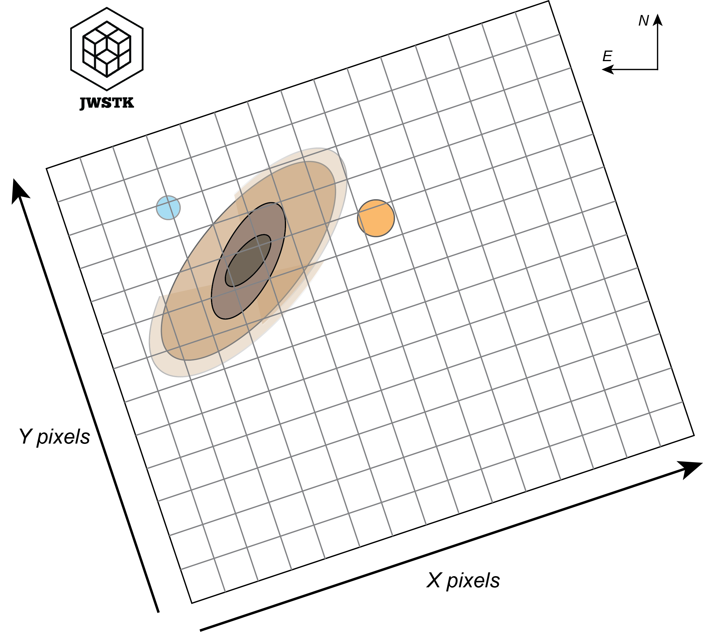

How to use *Image* object ?
=============================

.. warning::
    *Drafting documentation*

Image structure
-------------------

Getting started
^^^^^^^^^^^^^^^^

Attributes of the 'Image' object
^^^^^^^^^^^^^^^^^^^^^^^^^^^^^^^^^

+-----------------------+---------------------------------------------------------------------------------------------------+
| Attribut              | What is it?                                                                                       |
+=======================+===================================================================================================+
| Image.file_name       | The name of the file in .FITS format.                                                             |
+-----------------------+---------------------------------------------------------------------------------------------------+
| Image.primary_header  | The primary header of .FITS data.                                                                 |
+-----------------------+---------------------------------------------------------------------------------------------------+
| Image.data_header     | The header associated with data science.                                                          |
+-----------------------+---------------------------------------------------------------------------------------------------+
| Image.data            | The image, values stored in a 2D array.                                                           |
+-----------------------+---------------------------------------------------------------------------------------------------+
| Image.errs            | Errors associated with science data, stored in a 2D array.                                        |
+-----------------------+---------------------------------------------------------------------------------------------------+
| Image.size            | Image dimensions (nx, ny).                                                                        |
+-----------------------+---------------------------------------------------------------------------------------------------+
| Image.px_area         | Area of spatial pixels, in arcsec^2.                                                              |
+-----------------------+---------------------------------------------------------------------------------------------------+
| Image.units           | The unit of image values, by default these values are surface brightnesses given in MJy/sr.       |
+-----------------------+---------------------------------------------------------------------------------------------------+

Methods of the 'Image' object
^^^^^^^^^^^^^^^^^^^^^^^^^^^^^^^

+-----------------------------------+---------------------------------------------------------------------+
| Method                            | What does it do?                                                    |
+===================================+=====================================================================+
| Image.info()                      | Prints data-related information stored in headers.                  |
+-----------------------------------+---------------------------------------------------------------------+
| Image.plot()                      | Displays the image in a *matplotlib* figure.                        |
+-----------------------------------+---------------------------------------------------------------------+
| Image.get_px_coords()             | Converts R.A. Dec. coordinates in degrees to pixel coordinates.     |
+-----------------------------------+---------------------------------------------------------------------+
| Image.get_world_coords()          | Converts pixel coordinates to R.A. Dec. coordinates in degrees.     |
+-----------------------------------+---------------------------------------------------------------------+
| Image.crop()                      | Extract part of the image (i.e. a zoom).                            |
+-----------------------------------+---------------------------------------------------------------------+
| Image.rotate()                    | Apply a rotation using WCS.                                         |
+-----------------------------------+---------------------------------------------------------------------+
| Image.convolve()                  | Convolves the image from a PSF FWHM.                                |
+-----------------------------------+---------------------------------------------------------------------+
| Image.extract_intensity_profile() | Extracts an intensity profile from the image.                       |
+-----------------------------------+---------------------------------------------------------------------+

