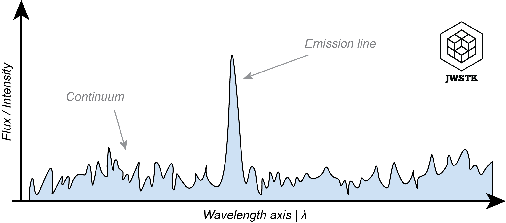

How to use *Spec* object ?
============================

.. warning::
    *Drafting documentation*

Spectrum structure
-------------------

Getting started
^^^^^^^^^^^^^^^^

Attributes of the 'Spec' object
^^^^^^^^^^^^^^^^^^^^^^^^^^^^^^^^^

+--------------+---------------------------------------------------------------+
| Attribut     | What is it?                                                   |
+==============+===============================================================+
| Spec.wvs     | The wavelength values of the spectrum.                        |
+--------------+---------------------------------------------------------------+
| Spec.values  | The brightness surface or flux values of the spectrum.        |
+--------------+---------------------------------------------------------------+
| Spec.units   |  The unit of the y axis values of the spectrum.               |
+--------------+---------------------------------------------------------------+
| Spec.dwvs    | Interval between two points on the wavelength axis, in µm.    |
+--------------+---------------------------------------------------------------+

Methods of the 'Spec' object
^^^^^^^^^^^^^^^^^^^^^^^^^^^^^^^

+----------------------+----------------------------------------------------------------------------------------------------------------------------------+
| Method               | What does it do?                                                                                                                 |
+======================+==================================================================================================================================+
| Spec.convert()       | Convert spectrum values into another unit ('MJy/sr', 'Jy', 'erg s-1 cm-2 Hz-1', 'erg s-1 cm-2 um-1', 'erg s-1 cm-2 um-1 sr-1').  |
+----------------------+----------------------------------------------------------------------------------------------------------------------------------+
| Spec.cut()           | Extract a part of the spectrum using limits of the requiered interval.                                                           |
+----------------------+----------------------------------------------------------------------------------------------------------------------------------+
| Spec.sub_baseline()  | Subtracts a baseline by fitting a polynomial around an emission line.                                                            |
+----------------------+----------------------------------------------------------------------------------------------------------------------------------+
| Spec.line_integ()    | Computes the integrated flux or surface brightness of a line.                                                                    |
+----------------------+----------------------------------------------------------------------------------------------------------------------------------+
| Spec.line_velocity() | Calculates the Doppler shift of an emission line using Gaussian profile fitting.                                                 |
+----------------------+----------------------------------------------------------------------------------------------------------------------------------+
| Spec.copy()          | Copy a spectrum.                                                                                                                 |
+----------------------+----------------------------------------------------------------------------------------------------------------------------------+
